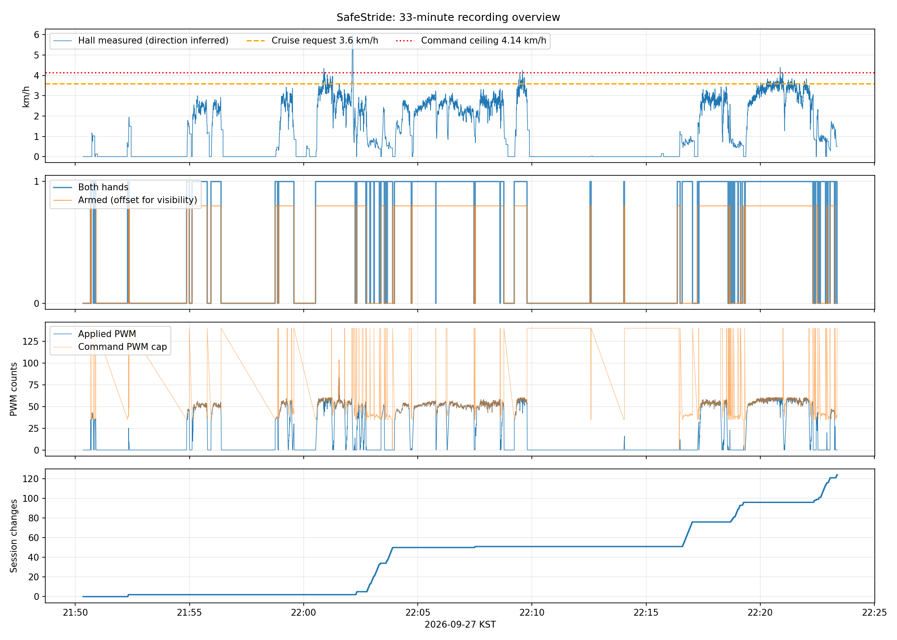
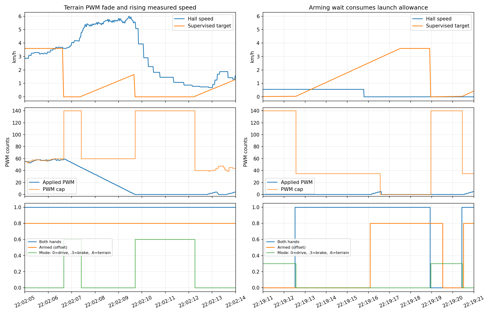

# 2026-09-27 로스백: 속도·ARM 상태 분석

작성일: 2026-09-28. 분석용 보고서이며 제어 코드·실행 설정·펌웨어는 변경하지 않았다.

가장 먼저 개선할 부분은 **ARM 대기와 통신 세션 유지의 결합**, **ARM 대기 중 소진되는 출발 보조 시간**, **내리막 PWM 감속과 실제 속도 감시의 관계**다. 출력이나 P 게인부터 높이면 이 문제들은 해결되지 않는다.

## 분석 범위와 한계

| 기록 | 실제 기록 구간(KST) | 길이 | 메시지 수 | 용도 |
|---|---|---:|---:|---|
| `power_test_20260927_181141` | 18:11:44.935–18:11:50.373 부근 | 5.439초 | 2,144 | 손 해제·정지 상태 확인 |
| `power_test_20260927_215017` | 21:50:20.498–22:23:22.315 부근 | 1,981.817초 | 859,644 | 주행·재출발·감속 분석 |

원본 위치: `/home/pdj/Stride/bags/`. MCAP 내장 메시지 정의로 디코딩했다. `/walker/status`, `/wheel/hall`, `/drive/command`, `/cmd_vel`, `/cmd_vel_safe`, `/handle/pressure`, `/terrain/status`, `/diagnostics`, GPS·노면·횡단보도 토픽을 대조했다.

시간 집계는 `/walker/status` 수신 시각부터 다음 상태 수신까지 이전 값을 유지하는 방식이며 마지막 표본 이후는 추정하지 않았다. 상태 관측 길이는 1,981.802초다. 중앙값·백분위는 메시지 표본 기준이다. 토픽 간 결합은 해당 시각 직전 메시지로 수행했으므로 수십 ms 차이는 송신·수신 지연의 영향을 받는다. 명령 비교에는 최근 0.25초 이내 명령만 사용했다.

코드 대조 기준은 로컬 HEAD `66b19e3`이다. Drive 펌웨어와 감독 노드 관련 최근 변경은 녹화 전 커밋이지만, 로스백에 실행 Git SHA·전체 파라미터·업로드 바이너리 해시가 없으므로 실제 실행본과 완전히 동일하다고 증명할 수는 없다. 진단의 `firmware_release_id=20260908`만으로 세부 빌드를 식별할 수 없다. 아래에서 **관측 사실**과 **코드에 근거한 원인 해석**을 구분한다.

Hall 속도는 반지름 0.115m, 12펄스/회전을 가정한 바퀴 속도다. 오른쪽 Hall 값은 왼쪽의 복제이며 독립 검증이 아니다. 방향도 실제 측정이 아니다. 휠 슬립·들어 올림·외부 밀기·실제 경사·압력센서 접촉 상태는 이 기록만으로 확정할 수 없다. `braking=true`는 출력 상태이며 물리적으로 멈췄다는 증명이 아니다.

## 주요 수치

짧은 기록은 전 구간 `armed=false`, `deadman=false`, PWM 0, Hall 속도 0이었다. 양손 raw 압력도 거의 0이며 누적 Hall 100이 변하지 않는다. `/cmd_vel=1.0m/s`는 있었지만 안전 명령과 Drive 명령은 기록되지 않았다. 진단의 `command_output_suppressed=true`와 일치한다. 이 파일을 주행 성능 비교나 ARM 실패의 증거로 사용하면 안 된다.

긴 기록은 다음과 같다.

| 항목 | 관측 결과 |
|---|---:|
| 원래 요청속도 | `/cmd_vel` 39,631개 모두 1.0m/s = 3.6km/h |
| 양손 접촉 감지 시간 | 1,023.164초 |
| ARMED 시간 | 896.379초, 28개 연속 구간 |
| 양손 접촉인데 비무장인 시간 | 144.706초, 양손 접촉 시간의 약 14.1% |
| 위 조건 중 신선한 양수 DRIVE 명령도 존재 | 142.469초 |
| 양손 접촉 false→true | 61회 |
| ARMED인데 PWM 0 | 37.742초; 정지·감속·대기 등 서로 다른 원인 포함 |
| 실제 PWM > 0 | 858.637초 |
| Hall 최대 측정속도 | 1.663475m/s = 5.989km/h |
| Hall > 1.15m/s(설정 목표속도 상한) | 3.959초; 목표 상한은 실제 속도 제한을 보장하지 않음 |
| 적용 PWM 최대 | 83/255 |
| MCU boot_id | 전체 기록에서 동일 |
| session_id 변경 | 124회 |
| MCU fault / watchdog / CRC / frame error | 해당 상태·카운터 모두 0 |
| link_ok=false | 3개 짧은 구간, 합계 약 0.049초 |

`armed=true`와 `deadman=false`가 일부 겹치는 것은 600ms 손 해제 감속 경로로 설명된다. 두 시간을 단순히 빼서 ARM 대기 시간을 구하면 안 된다.

## 1. 우선 개선: ARM 거부 때문에 통신 세션까지 재생성되는 구조

**관측:** 세션 변경 124회 직전 상태가 모두 DISARMED였다. 그중 123회는 양손 접촉 상태였다. 세션 변경 간격 중앙값은 약 1.049초다. MCU 재부팅·CRC 오류·watchdog 플래그는 없다.

대표적으로 **22:16:34.768–22:17:01.904의 27.136초** 동안 양손 접촉인데도 PWM 0·DISARMED가 이어진다. 이 구간 Hall 속도는 대략 0.13–0.28m/s다. 22:02:45 이후와 22:22:37 이후에도 비슷한 대기가 반복된다.

**코드 해석:** 일반 DRIVE로 ARM할 때는 `stationaryDwellMet()`가 필요하다. 기준은 양쪽 필터 속도 ±100mrad/s, 즉 약 ±0.0115m/s 이내를 250ms 유지하는 것이다. 따라서 사용자가 천천히 밀고 있으면 의도된 정지 전용 ARM 조건을 만족하지 않는다.

그런데 이 조건으로 명령을 거부하면 `markAcceptedCommand()`를 호출하지 않고, 마지막 세션 활동 시간도 갱신하지 않는다. 1초 후 `SESSION_LOSS_TIMEOUT_MS`가 지나 세션을 지우고 다시 연결한다. 관측된 1초 주기의 세션 변경과 매우 잘 맞는다. 이는 **통신선 불량이나 MCU 재부팅보다 ARM 거부와 세션 생존 조건의 결합이 주원인이라는 강한 근거**다. 다만 명령 거부 사유 자체는 기록되지 않았다.

**권장 변경:**

- 통신 세션 유지와 구동 명령 수락을 분리한다. 출력이 꺼진 ARM 대기 중에는 검증된 세션 유지 응답을 허용하되, 그것을 주행 허가나 구동 watchdog 갱신으로 취급하지 않는다.
- `arm_ready`, `arm_inhibit_reason`, `stationary_dwell_ms`, `last_rejected_sequence`, `last_applied_sequence`를 기록한다. 지금의 `disarmed`만으로는 기다려야 하는 이유를 알 수 없다.
- 정지 전용 재출발이 제품 정책이면 화면에 '정지 후 재출발 대기'를 표시한다. 보행 중 보조 재접속이 요구된다면 별도 정책과 출력 상승 제한으로 설계한다. 이번 관측의 0.1–0.3m/s를 그대로 안전한 ARM 역치로 정하면 안 된다.

근거: `firmware/safestride_mcu/safestride_mcu.ino`의 `handleCommand()`(554행 부근), `markAcceptedCommand()`(425행), `enforceWatchdogs()`(603행), 정지 판정(686행); `config.h`의 ARM·세션 역치.

## 2. 우선 개선: 5초 속도 유지와 4초 출발 보조의 시간 충돌

**관측 A — 과거 속도로 ARM 대기:** 22:03:49 이후 Hall 속도가 약 0.119m/s에 머물고 새 펄스 나이는 증가한다. 약 5초가 지나 속도가 0으로 바뀐 뒤 250ms 정지 대기를 거쳐 **22:03:53.803에 ARM**한다. 그 순간 보조 cap은 이미 0이다.

**관측 B — 출발 보조가 실제로 매우 짧음:**

| 시각(KST) | 상태 |
|---|---|
| 22:19:12.515 | 양손 접촉. 과거 Hall 약 0.154m/s 때문에 DISARMED |
| 22:19:16.081 | 약 3.57초 기다린 뒤 ARMED |
| 22:19:16.509 부근 | 적용 PWM 약 4 |
| 22:19:16.6 부근 이후 | 4초 무펄스 제한으로 cap 0, 출력 0 |
| 22:19:18.5 부근 | 손을 계속 잡고 ARMED인데도 출력 0 유지 |

**코드 해석:** Hall 필터는 새 펄스에서만 바뀌고 무펄스 5초에 0이 된다. 반면 출발 보조의 4초 시계는 `_status_callback()`에서 양손 접촉을 처음 감지할 때 시작한다. ARM 대기 또는 지형 정지 중에도 이 시간이 흐른다. 두 조건이 충돌해 실제 출발 기회를 소모한다.

**권장 변경:**

- `마지막 펄스 구간속도`, `현재 추정속도`, `속도 유효성`, `정지 추정`을 분리한다. 5초 지난 속도가 0이 된 사실을 물리적 정지의 증거로 단정하지 않는다. 펄스 나이 기반 추정에는 저속 해상도와 센서 고장도 함께 고려한다.
- 출발 보조 시간은 **구동 허가·정지 해제·출발 출력 조건을 만족한 시점**부터 별도로 계산한다. ARM 대기와 지형 정지가 출발 기회를 모두 소진하지 않도록 한다.
- 그렇다고 비무장·펄스 잡음·상태 토글마다 4초를 무제한 재시작하지 않는다. 한 접촉 주기의 누적 통전 제한과 실패 상태를 둔다.
- cap=0 이유를 `launch_waiting`, `no_motion_timeout`, `terrain_hold` 등으로 구분해서 기록·표시한다.

근거: `motor_control.cpp`의 `updateHallFeedback()`(320–339행 부근), 감독 노드 `_status_callback()`(433행), `_walking_assist_pwm_cap()`(458행).

## 3. 우선 개선: BRAKE 명령으로 ARM 정지 조건을 우회할 수 있음

**관측:** 22:02:19.554에는 Hall 약 0.191m/s인데 `mode=BRAKE`, 목표 0으로 ARM한다. 22:07:30.444에도 약 0.279m/s에서 비슷한 전환이 보인다. 다른 구간에서는 훨씬 낮은 속도에서도 일반 DRIVE ARM이 계속 거부된다.

**코드 해석:** DISARMED에서 정지 대기를 검사하는 조건이 `mode == DRIVE`에만 걸려 있다. BRAKE/TERRAIN_STOP은 정지 대기 없이 ARMED로 바뀔 수 있다. 이후 이미 ARMED라면 DRIVE 전환에서 같은 정지 조건을 다시 검사하지 않는다. 손 해제 직후의 짧은 BRAKE 명령과 재접촉이 겹치면 재출발 결과가 경로에 따라 달라질 수 있다. BRAKE 프레임 자체가 양수 출력을 내는 것은 아니지만, 주행 허가 상태를 바꿔 놓는다.

**권장 변경:** 정지 명령의 수락과 추진 허가를 분리한다. BRAKE는 비무장 상태에서도 수락할 수 있어야 하지만 그것만으로 이후 DRIVE 권한을 얻으면 안 된다. 실제 추진 시작 조건을 모든 모드 전환에서 일관되게 검사한다. 이때 기존 손 해제 감속과 정상 통신 회복을 함께 회귀 검증한다.

근거: `safestride_mcu.ino:554`의 `mode == 0U` 조건 및 ARMED 명령 수락 분기; 브리지 `_command_tick()`.

## 4. 우선 개선: 내리막 PWM 감소가 실제 감속을 보장하지 않음

**관측:** **22:02:06.656**, 적용 PWM 약 58에서 TERRAIN_STOP에 들어간다. 이후 약 3초 동안 PWM이 0으로 줄지만 Hall 속도는 약 1.00m/s에서 **22:02:09.434의 1.663m/s(약 6.0km/h)**까지 상승한다.

- 22:02:08–09의 누적 Hall 증분도 26펄스, 약 1.566m다. 단지 화면의 과거 속도 유지로 생긴 피크는 아니다. 다만 펄스 계측·휠 보정 자체의 정확성은 별도 문제다.
- 같은 시점 GPS 원시 속도도 1.884–1.997m/s로 높아지지만 필터 값은 약 0.94–0.98m/s다. 서로 다른 지연·품질의 값이므로 정확한 실제 지상속도나 가속 원인은 확정하지 않는다.
- 이 구간 양손 접촉과 ARMED는 유지된다. 손 해제 때문에 생긴 정지는 아니다.
- 다른 지형 감속에서도 PWM 0 후 Hall 속도가 남는 구간이 있어, `PWM=0`을 '정지 완료'로 표시하면 부정확하다.

**코드 해석:** TERRAIN_STOP은 실제 PWM을 3초 선형 감소시킨다. 지형 분기에서는 일반 속도 피드백과 Hall plausibility 감시를 사용하지 않고 먼저 return한다. 절대 과속 감시도 그 뒤에 있어 이 경로에서는 평가되지 않는다. **이번 최대 6.0km/h는 설정된 8km/h 절대 과속 역치 미만**이므로 실제 8km/h 보호 실패를 관측한 것은 아니다. 과속 감시의 분기 순서는 별도로 고쳐야 할 코드상 취약점이다.

**권장 변경:**

- 출력 감소 중에도 속도 유효성·과속 감시가 계속 동작하도록 보호 우선순위를 정리한다.
- '출력 감소 중', '출력 0', '움직임 감지', '정지 추정'을 구분한다. 실제 감속이 일어나지 않을 때의 대응 조건을 설계한다.
- 3초라는 고정 시간만으로 완료를 판단하지 말고, 검증된 속도·경사·제동 하드웨어 특성으로 안전한 대응을 정한다. 모터 PWM 0/LOW-LOW의 실제 제동력은 기록만으로 확인할 수 없다.
- Pi가 경사 회복으로 DRIVE를 보내도 MCU는 남은 3초 감속을 마칠 수 있다. `terrain_stop_active`, 경과시간, 복귀 상태를 MCU에서 발행해 상위 상태와 일치시킨다.

근거: `motor_control.cpp:385` 지형 감속 분기의 early return, `:409` 이후 과속 검사; `safety_logic.py`의 `SlopeBrakePolicy`.

## 5. 속도 튜닝: 목표 추종과 보행 보조의 목적을 먼저 일치시키기

**관측:** ARMED·양손 접촉·신선한 DRIVE·목표 약 1m/s·경사 FF 0·Hall 나이 0.3초 미만인 구간은 666.421초다. 이 표본의 Hall 중앙값은 **0.7619m/s(2.74km/h)**, 적용 PWM 중앙값은 54다. 시간 기준 약 **85.4%**에서 적용 PWM이 직전 명령 cap의 ±1count 범위에 있다. 비동기 토픽·펄스별 cap 변화·MCU 상태 때문에 모든 표본이 정확히 같은 cap을 가리키지는 않는다.

**해석:** 현재 평지 cap은 대략 `35 + 25 × clamp(v_effective/1.0, 0, 1)`이다. 0.5m/s에서는 약 48, 0.76m/s에서는 약 54다. 사용자가 느리게 움직이면 더 작은 보조를 주는 설계다. 따라서 요청 3.6km/h보다 실제가 느리다는 사실만으로 제어 실패라고 단정할 수 없다. 사용자의 힘·부하가 기록되지 않아 원인별 기여는 분리되지 않는다.

정속 3.6km/h 달성이 목적이라면 이 cap이 속도 오차 보정 출력을 막는지 먼저 검토해야 한다. 이미 cap에 자주 닿으므로 **P 게인만 올려도 속도가 충분히 오르지 않을 가능성이 높다.** 반대로 사용자의 보행 속도에 맞춰 보조하는 것이 목적이라면, 고정 목표 1m/s와 속도 기반 cap의 관계를 명확히 하고 UI에서 '요청속도'를 '실제 보행속도'처럼 표시하지 않아야 한다.

권장 순서는 ARM·출발 시간 충돌 해결 → 평지·일정 부하에서 FF/PWM 실측 → 보조 정책 선택 → 제한 안에서 조정이다. 최대 PWM 140을 바로 올리거나 전 구간 cap을 높일 근거는 없다. 경사 FF가 양수인 Drive 메시지는 44개뿐이어서 오르막 +45의 성능도 이번 기록만으로 충분히 검증되지 않는다.

## 6. 압력·짧은 손 해제·재가속을 함께 개선

양손 접촉이 잠깐 끊겼다 돌아오는 구간 중 **0.5초 미만 14회**, **1초 미만 25회**가 있다. 실제 손을 놓았는지 센서 접촉이 흔들렸는지는 영상 없이 구분할 수 없다. 일부 raw 값은 0까지 떨어지고, 일부는 한쪽만 역치 근처로 떨어진다.

정상적인 ARMED 종료는 대부분 손 해제 감지 후 약 0.6초에 SAFE_STOP으로 바뀌어 설계와 맞는다. 그러나 감속 중 다시 잡으면 ARM은 유지될 수 있어도 Pi 목표는 0에서 다시 올라간다. MCU에서도 낮은 내부 목표와 남아 있는 측정속도의 오차 때문에 음수 P 보정이 생겨 출력이 0에 머무는 구간이 보인다. 예를 들어 22:05:47.671 이후 약 0.73초 동안 양손 접촉·양수 DRIVE인데도 PWM 0이 이어진다.

권장: 압력센서 장착·좌우 raw 분포를 먼저 검증하고, 손 해제 감속·재접촉·재출발 상태를 명시적으로 나눈다. 의도된 감속을 취소하고 과거 PWM을 즉시 복원하거나, 기록만 보고 해제 디바운스를 길게 늘리는 방식은 적절하지 않다. 실제 필요한 재가속의 연속성과 안전한 출력 한도를 시험해야 한다.

## 7. 표시와 진단을 실제 제어 상태에 맞추기

- `armed=true`는 추진 허가 상태이고 실제 출력·정지 완료와 다르다. 37.742초의 ARMED/PWM0를 고장이라고 통합 표시하지 말고 원인을 보여준다.
- 감독 진단에서 `drive_mode=BRAKE`인데 직전 신선한 `/drive/command.mode=TERRAIN_STOP`인 표본이 **18개**다. 진단 경로가 DOWNHILL 분류를 BRAKE로 표시하는 반면 실제 명령 경로는 3초 감속 모드를 보낼 수 있다. 발행한 명령에서 진단값을 직접 만들도록 수정하는 편이 좋다.
- 현재 MCU telemetry에는 내부 ramp 목표·ARM 거부 사유·지형 감속 활성/남은 시간·과속 latch 원인이 부족하다. 재현을 위해 이 값을 추가하고 실행 Git SHA·설정 snapshot·펌웨어 해시를 녹화와 함께 저장한다.
- 긴 기록에서 `/cmd_vel_safe`·`/drive/command`가 끊기는 많은 구간은 손 해제 시 의도적으로 발행을 억제하는 경로와 맞는다. 이 간격 자체를 네트워크 손실로 단정하거나 timeout을 늘려서는 안 된다.

## 8. 센서 정책을 활성화하기 전 보완할 사항

- 짧은 기록의 ToF는 유효하지만 전부 `TOF_RAISED`다. 긴 기록에서는 ToF 무효가 약 **80.24초**, `terrain_hazard=true`가 약 **222.95초**다. 초반 기준거리 0.625m 대비 측정이 약 0.17–0.19m인 예가 있다. 설치 높이·각도·시험 중 주변 물체를 확인해야 하며, 이것만으로 오검출로 단정할 수 없다. 현재 로컬 설정은 ToF 정지 비활성이고 관측에서도 이 위험이 직접 정지를 일으켰다고 볼 근거가 없다. 바로 정지 기능을 켜기 전에 기준을 재검증한다.
- 노면 인식은 긴 기록 1,982개 중 1,017개가 invalid이고, 감독 진단상 `surface_control_enabled=false`다. 이번 속도 변화의 직접 원인으로 삼으면 안 된다.
- 횡단보도 진단은 motion output disabled이며 API 429/404도 반복된다. 표시·데이터 수집 개선은 필요하지만 이번 모터 속도 변경 원인과는 분리한다.
- GPS는 속도 필터가 stationary로 보는 중에도 Hall이 0.5m/s를 넘는 진단 시점이 135개 있다. Hall과 GPS가 동시에 틀릴 수도 있고 위치 잡음·필터 지연·휠 움직임만 존재할 수도 있다. GPS를 즉시 대체 제어 피드백으로 쓰거나 정지 증명으로 사용하지 않는다.

## 권장 구현 순서와 확인 기준

| 순서 | 변경 대상 | 확인해야 할 결과 |
|---|---|---|
| 1 | ARM 대기/통신 세션 분리, BRAKE→DRIVE 허가 일관성 | 정지 전용 ARM 정책을 유지한 채 대기 중 세션 재생성 0회; 명령 모드 경로에 따라 추진 허가가 달라지지 않음 |
| 2 | 출발 보조 시계와 무펄스 상태 | ARM 대기·지형 정지 때문에 실제 출발 기회가 소진되지 않음; 상태 토글로 무제한 통전 불가 |
| 3 | 지형 감속 중 속도 감시·상태 보고 | 감속 경로에서도 보호 검사 실행; PWM 0과 정지를 구분; 감속 중 속도 상승 사례를 시험으로 검증 |
| 4 | 압력 재접촉·재가속·표시 | 짧은 해제 후 반응이 일관됨; 과거 출력의 갑작스러운 복원 없음; 대기 이유 표시 |
| 5 | 목표속도·보조 cap·FF 튜닝 | 실제 부하에서 정속/보조 목적에 맞게 평가; cap 포화·속도 오차·출발 지연을 따로 측정 |

검증 시에는 이번 사건의 토픽 시계열을 재생하는 소프트웨어 검사와 함께, MCU의 명령 수락·세션 유지·모드 전환 검사를 해야 한다. PWM과 실제 가감속의 관계는 실기 검증이 필요하며 로스백 재생만으로 증명되지 않는다.

이 보고서는 분석과 수정 제안까지만 수행했다. 후속 속도 동작 변경을 구현할 때는 저장소 규칙에 따라 `docs/SPEED_CHANGE_THRESHOLDS_KO.md`의 진입·출력 변화·복귀 조건과 실제 동작을 함께 갱신해야 한다.
